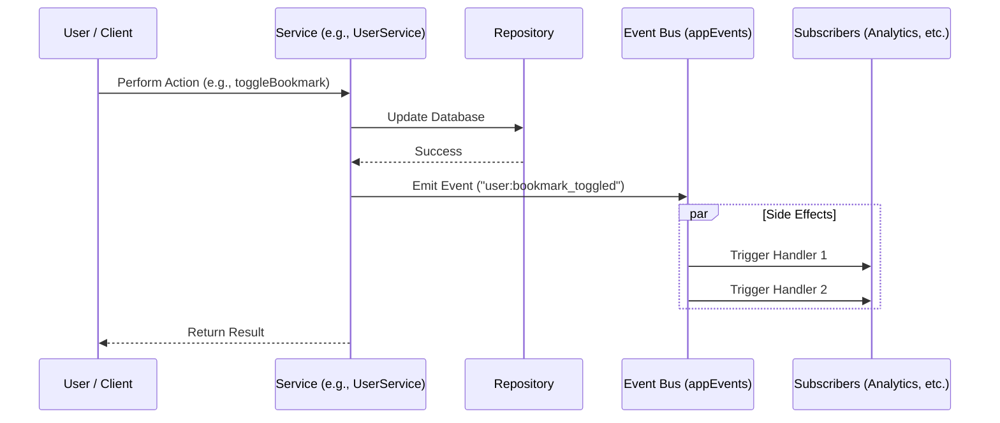

# Advanced Patterns & Architecture

This guide covers architectural patterns and techniques to ensure the codebase remains maintainable, testable, and robust as it scales.

## 1. Composition over Inheritance

React is built on composition. Avoid deep inheritance hierarchies or creating "Super Components" that do everything.

### Pattern: Compound Components
Instead of a single component with 20 props, use Compound Components for flexibility.

**Bad:**
```tsx
<Modal 
  title="Hello" 
  content="World" 
  footerButton="Close" 
  onClose={close} 
/>
```

**Good:**
```tsx
<Dialog open={isOpen} onOpenChange={setIsOpen}>
  <DialogContent>
    <DialogHeader>
      <DialogTitle>Hello</DialogTitle>
    </DialogHeader>
    <p>World</p>
    <DialogFooter>
      <Button onClick={close}>Close</Button>
    </DialogFooter>
  </DialogContent>
</Dialog>
```

## 2. Dependency Injection (in Services)

To make logic testable and decoupled, avoid hardcoding dependencies inside your business logic classes/functions.

**Example**:
Instead of importing the database client directly into a deep function, pass it as a dependency or use the **Repository Pattern** defined in `project-structure.md`.

## 3. SOLID Principles in React

*   **Single Responsibility**: A component should ideally do one thing (e.g., *only* display a user card, not fetch data AND format date AND display).
*   **Open/Closed**: Components should be open for extension but closed for modification. (Use props/children to extend behavior without rewriting the component).

## 4. Error Handling Strategy

### Server Actions
Always use a standardized return type for Server Actions to handle success/error states gracefully in the UI.

```typescript
type ActionResponse<T> = 
  | { success: true; data: T }
  | { success: false; error: string };

export async function submitData(formData: FormData): Promise<ActionResponse<string>> {
  try {
    // ... logic
    return { success: true, data: "ID_123" };
  } catch (e) {
    return { success: false, error: "Validation failed" };
  }
}
```

### Global Error Barriers
Use `error.tsx` in Next.js route segments to catch unexpected runtime errors and display a fallback UI without crashing the entire app.

## 5. Event-Driven Architecture (Observer Pattern)

We use a lightweight, typed event bus to decouple side effects from core business logic. This allows us to perform actions like analytics logging, cache invalidation, or sending notifications without cluttering the primary service methods.

### The Flow



### Implementation

The system is built on two core files:
1.  **`src/lib/event-emitter.ts`**: A generic `TypedEventEmitter` class.
2.  **`src/services/event-bus.ts`**: The singleton instance (`appEvents`) and the Type Definition (`AppEventMap`).

### How to Add a New Event

1.  **Define the Event Type**: Add a new key and payload type to `AppEventMap` in `src/services/event-bus.ts`.

```typescript
// src/services/event-bus.ts
export interface AppEventMap {
  // ... existing events
  "company:created": {
    companyId: string;
    name: string;
    createdBy: string;
  };
}
```

2.  **Emit the Event**: In your Service method, emit the event after the core action succeeds.

```typescript
// src/services/company.service.ts
import { appEvents } from "@/services/event-bus";

async createCompany(...) {
  // ... db logic
  await appEvents.emit("company:created", { ... });
}
```

3.  **Subscribe to the Event**: Register a listener (usually in a startup script or a dedicated effects manager).

```typescript
appEvents.subscribe("company:created", async (payload) => {
  await analytics.track("Company Created", payload);
});
```

## 6. Barrel Files (Index files)

Use `index.ts` files to export public members of a module. This creates a clean public API for other parts of the app.

**Structure**:
`src/components/ui/index.ts` -> `export * from './button'; export * from './input';`

**Import**:
`import { Button, Input } from '@/components/ui';`
