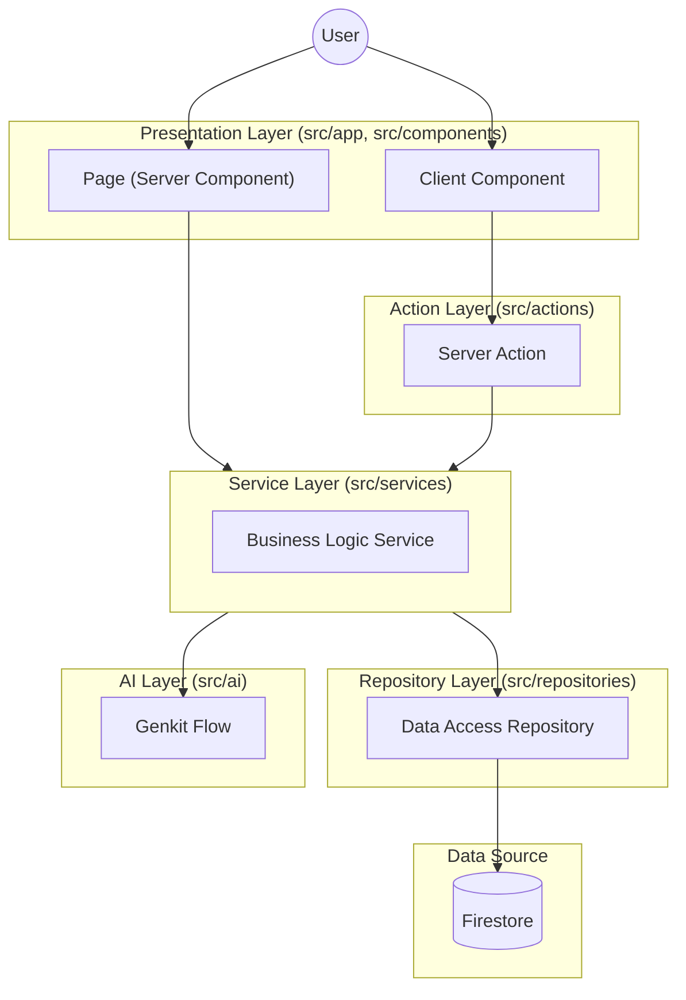

# Project Structure

The project follows a **Layered Architecture** to separate concerns (Presentation, Business Logic, Data Access).

## Directory Overview

```
src/
├── app/                  # Next.js App Router (Pages, Layouts, API routes)
│   ├── actions/          # Server Actions (standard entry point for mutations)
│   ├── (auth)/           # Route groups (e.g., login, signup)
│   ├── companies/        # Feature routes
│   └── ...
├── ai/                   # AI logic using Genkit (Flows, configuration)
├── components/           # React Components
│   ├── ai/               # AI-related components
│   ├── company/          # Company-related components
│   ├── problem/          # Problem-related components
│   ├── ui/               # Reusable UI components (Shadcn UI, etc.)
│   └── shared/           # Shared utility components (Spinners, etc.)
├── constants/            # Global constants
├── contexts/             # React Contexts
├── hooks/                # Custom React Hooks
├── lib/                  # Library configurations and utilities
│   ├── firebase.ts       # Firebase initialization
│   └── utils.ts          # Common utility functions
├── repositories/         # Data Access Layer (Direct DB interactions)
├── services/             # Business Logic Layer (Orchestrates data & rules)
└── types/                # TypeScript type definitions
```

## Architectural Layers



1.  **Presentation Layer (`src/app`, `src/components`)**:
    *   **Pages (`src/app`)**: Server Components by default. Responsible for initial data fetching and layout.
    *   **Components (`src/components`)**: Reusable UI blocks. Organized by feature (e.g., `company`, `ai`) or generic type (`ui`).

2.  **Action Layer (`src/app/actions`)**:
    *   **Server Actions**: Functions running on the server, callable from Client Components.
    *   **Responsibility**: Validate inputs, authentication checks, and call the **Service Layer**.

3.  **Service Layer (`src/services`)**:
    *   **Encapsulation**: dependent Logic & Orchestration.
    *   **Responsibility**: Contains business rules, validates complex logic, and calls the **Repository Layer** or **AI Layer**.
    *   **Pattern**: Export singleton instances or classes (e.g., `aiService`, `companyService`).

4.  **Repository Layer (`src/repositories`)**:
    *   **Data Access**: Direct interaction with the database (Firebase/Firestore).
    *   **Responsibility**: CRUD operations, querying, and raw data handling. Return typed objects.

5.  **AI Layer (`src/ai`)**:
    *   **Genkit Flows**: logic for specific AI tasks (e.g., `groupQuestions`).
