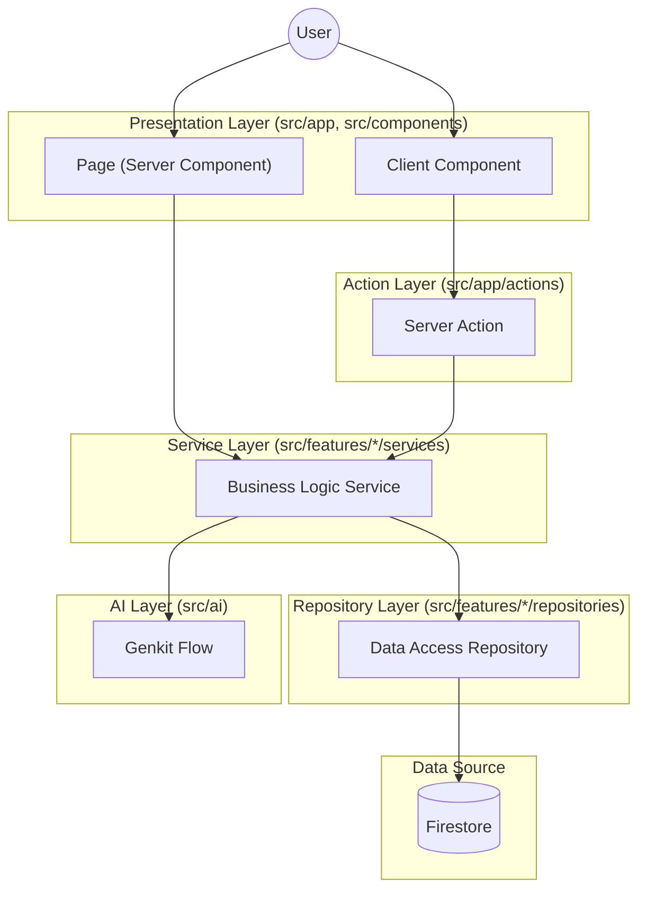

# Project Structure

This document provides a detailed breakdown of the **Byte to Offer** codebase organization.

## Root Directory

```
byte-to-offer/
├── .agent/              # Agent rules and configurations
├── .genkit/             # Genkit runtime data (traces, servers)
├── .github/             # GitHub workflows and templates
├── .husky/              # Git hooks (pre-commit, etc.)
├── .kiro/               # Kiro steering files and settings
├── .next/               # Next.js build output (generated)
├── .storybook/          # Storybook configuration
├── guide/               # Project guides and documentation
├── public/              # Static assets (images, fonts, icons)
├── scripts/             # Build and utility scripts
├── src/                 # Application source code
├── storybook-static/    # Storybook build output
└── tests/               # E2E and integration tests
```

## Configuration Files

| File | Purpose |
|------|---------|
| `next.config.ts` | Next.js configuration |
| `tailwind.config.js` | Tailwind CSS theme and plugins |
| `tsconfig.json` | TypeScript compiler options |
| `firebase.json` | Firebase project configuration |
| `firestore.rules` | Firestore security rules |
| `jest.config.ts` | Jest test runner configuration |
| `vitest.config.ts` | Vitest test runner configuration |
| `components.json` | shadcn/ui component configuration |
| `eslint.config.mjs` | ESLint rules |
| `vercel.json` | Vercel deployment settings |

## Source Directory (`src/`)

### `src/app/` - Next.js App Router

Routes and API endpoints following Next.js 16 App Router conventions.

```
app/
├── actions/             # Server Actions
│   ├── ai.actions.ts
│   ├── company.actions.ts
│   ├── contact.actions.ts
│   ├── problem.actions.ts
│   └── user.actions.ts
├── api/                 # API Routes
│   ├── companies/
│   ├── problems/
│   └── test-pagination/
├── auth/action/         # Auth callback handlers
├── blog/[slug]/         # Blog pages (dynamic)
├── companies/           # Companies listing page
├── company/[companySlug]/ # Company detail page (dynamic)
├── contact/             # Contact form page
├── forgot-password/     # Password reset page
├── login/               # Login page
├── privacy-policy/      # Privacy policy page
├── problems/            # Problems listing page
├── profile/             # User profile page
├── signup/              # Registration page
├── submit-problem/      # Problem submission page
├── terms-of-service/    # Terms page
├── tools/               # Developer tools
│   └── typing-test/     # Typing speed test
├── ~offline/            # Offline fallback page (PWA)
├── error.tsx            # Global error boundary
├── globals.css          # Global styles
├── layout.tsx           # Root layout
├── loading.tsx          # Global loading state
├── not-found.tsx        # 404 page
├── page.tsx             # Home page
├── robots.ts            # robots.txt generator
└── sw.ts                # Service worker
```

### Action Layer (`src/app/actions/`)

Server Actions are functions that run on the server and can be called directly from Client Components.

**Responsibilities:**
- Validate user inputs before processing
- Perform authentication and authorization checks
- Call the **Service Layer** to execute business logic
- Handle errors and return appropriate responses

**Available Server Actions:**
- `ai.actions.ts` - AI feature actions (insights, flashcards, grouping)
- `company.actions.ts` - Company data operations
- `contact.actions.ts` - Contact form submissions
- `problem.actions.ts` - Problem submissions and updates
- `user.actions.ts` - User profile and preference updates

### `src/components/` - Shared Components

```
components/
├── ads/                 # Ad placement components
├── ai/                  # AI-powered UI components
│   ├── ai-grouping-section.tsx
│   ├── company-strategy-generator.tsx
│   ├── flashcard-generator.tsx
│   ├── problem-insights-dialog.tsx
│   └── similar-problems-dialog.tsx
├── icons/               # Custom icon components
├── landing/             # Landing page sections
│   ├── feature-section.tsx
│   ├── footer.tsx
│   ├── hero-section.tsx
│   ├── search-section.tsx
│   └── stats-section.tsx
├── layout/              # Layout components
│   └── header/          # Navigation header
├── sections/            # Reusable page sections
├── seo/                 # SEO components (structured data)
├── shared/              # Shared utilities (theme)
├── skeletons/           # Loading skeleton components
└── ui/                  # shadcn/ui primitives
```

### `src/components/ui/` - UI Primitives

Each component follows the standard structure:

```
ui/{component}/
├── {component}.tsx
├── {component}.test.tsx
├── {component}.stories.tsx
└── index.ts
```

Available components:
- `accordion`, `alert`, `alert-dialog`, `avatar`, `badge`
- `breadcrumb`, `button`, `calendar`, `card`, `checkbox`
- `chip`, `chip-group`, `dialog`, `drawer`, `dropdown-menu`
- `error-boundary`, `feature-card`, `floating-shapes`, `form`
- `input`, `label`, `offline-image`, `offline-indicator`
- `pagination`, `password-input`, `popover`, `radio-group`
- `scroll-area`, `select`, `separator`, `sheet`, `shine-button`
- `skeleton`, `stat-item`, `switch`, `table`, `tabs`
- `textarea`, `toast`, `toaster`, `tooltip`

### `src/features/` - Feature Modules

Self-contained domain modules with their own components, hooks, and services.

```
features/
├── auth/                # Authentication
│   ├── components/
│   ├── context/
│   ├── hooks/
│   ├── services/
│   ├── types/
│   └── index.ts
├── companies/           # Company data and listings
│   ├── api/
│   ├── components/
│   ├── hooks/
│   ├── repositories/      # NEW: Company repository
│   ├── services/          # NEW: Company service
│   ├── types/
│   └── index.ts
├── contact/             # Contact form feature
│   ├── components/
│   ├── repositories/      # NEW: Contact repository
│   ├── services/          # NEW: Contact service
│   └── index.ts
├── problems/            # Interview problems
│   ├── components/
│   ├── constants/
│   ├── hooks/             # NEW: Problem interaction hooks
│   ├── repositories/      # NEW: Problem repository
│   ├── services/          # NEW: Problem services
│   ├── types/
│   ├── utils/
│   └── index.ts
├── profile/             # User profile management
│   ├── components/
│   ├── repositories/      # NEW: User repository
│   ├── services/          # NEW: User service
│   └── index.ts
└── tools/               # Developer tools
    ├── __tests__/
    ├── components/
    ├── hooks/             # NEW: Typing game hooks
    ├── utils/
    └── index.ts
```

### `src/ai/` - Genkit AI Flows

```
ai/
├── flows/               # AI flow definitions
│   ├── __tests__/
│   ├── find-similar-questions-flow.ts
│   ├── generate-company-strategy-flow.ts
│   ├── generate-flashcards-flow.ts
│   ├── generate-problem-insights-flow.ts
│   └── group-questions.ts
├── services/            # AI service orchestration
│   └── ai.service.ts
├── cache.ts             # AI response caching
├── dev.ts               # Flow registration for dev UI
├── flow-registry.ts     # Flow registry
├── genkit.ts            # Genkit instance configuration
├── model-registry.ts    # Model configuration
└── utils.ts             # AI utilities
```

### `src/lib/` - Utilities and Configuration

```
lib/
├── api/
│   └── firebase.ts      # Firebase client initialization
├── config/
│   └── navigation.ts    # Navigation configuration
└── utils/
    ├── __tests__/
    ├── cache/           # Caching utilities
    ├── error-handler.ts # Error handling utilities
    ├── event-emitter.ts # Event emitter pattern
    ├── index.ts         # cn() and common utilities
    ├── logger.ts        # Logging utilities
    └── lru-cache.ts     # LRU cache implementation
```

### `src/services/` - Shared Business Logic

```
services/
├── __tests__/
└── event-bus.ts               # Event bus for cross-feature communication
```

**Note:** Most services are located in their respective feature directories. This folder is only for truly global services.

### `src/hooks/` - Global Custom Hooks

```
hooks/
├── __tests__/
├── use-ai-cooldown.ts         # AI rate limiting
├── use-ai-features.ts         # AI feature flags
├── use-cursor-pagination.ts   # Cursor-based pagination
├── use-media-query.ts         # Responsive breakpoints
├── use-mounted.ts             # Component mount state
├── use-navbar-scroll.ts       # Navbar scroll behavior
├── use-online-status.ts       # Network status detection
├── use-problem-interactions.tsx # Problem interaction tracking
├── use-speech.ts              # Text-to-speech
├── use-toast.ts               # Toast notifications
├── use-typing-game.ts         # Typing test game logic
└── use-typing-placeholder.ts  # Animated placeholder text
```

### `src/providers/` - Context Providers

```
providers/
├── auth-provider.tsx    # Authentication context
├── theme-provider.tsx   # Theme (dark/light) context
├── index.ts             # Barrel exports
└── README.md            # Provider documentation
```

### `src/types/` - Shared TypeScript Types

```
types/
├── __tests__/
├── ai.ts                # AI-related types
├── amp.d.ts             # AMP type declarations
├── common.ts            # Common utility types
├── index.ts             # Barrel exports
├── job-application.ts   # Job application types
├── typing-test.ts       # Typing test types
├── ui.ts                # UI component types
└── user.ts              # User types
```

### `src/constants/` - Application Constants

```
constants/
├── colors.ts            # Color palette constants
├── features.ts          # Feature flag constants
└── typing-test-snippets.ts # Typing test code snippets
```

### `src/__tests__/` - Test Files

```
__tests__/
├── app/                 # App route tests
├── components/          # Component tests
├── factories/           # Test data factories
├── lib/                 # Utility tests
└── security/            # Security tests
```

## Data Flow



## Import Conventions

```typescript
// External libraries
import { useState } from "react";
import { useForm } from "react-hook-form";

// UI components
import { Button, Card } from "@/components/ui";

// Features (use barrel exports)
import { useAuth, LoginForm } from "@/features/auth";

// Services and repositories
import { problemService } from "@/services/problem.service";

// Types
import type { User, Problem } from "@/types";

// Utilities
import { cn } from "@/lib/utils";
```
