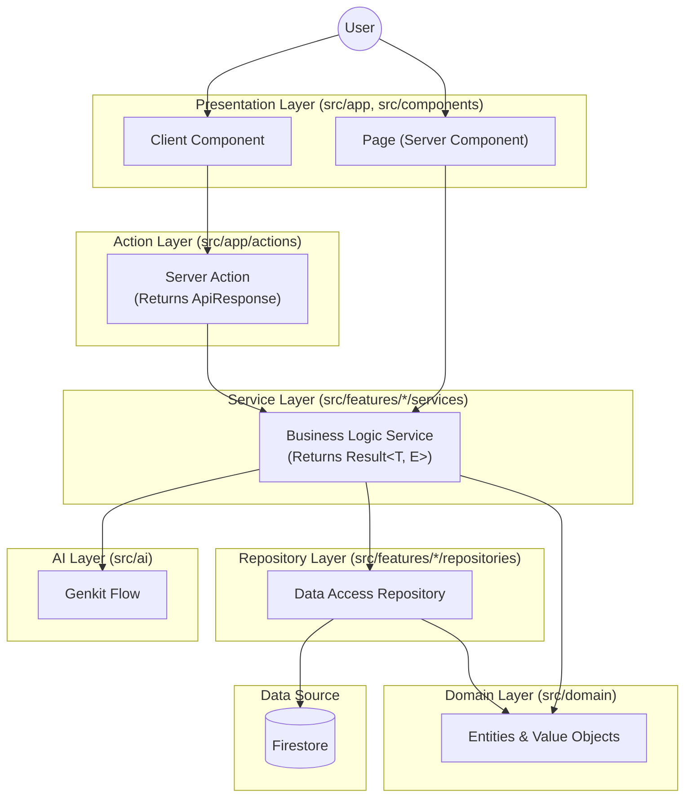

# Project Structure

This document provides a detailed breakdown of the **Byte to Offer** codebase organization.

## Root Directory

```
byte-to-offer/
├── .agent/              # Agent rules and configurations
├── .genkit/             # Genkit runtime data (traces, servers)
├── .github/             # GitHub workflows and templates
├── .husky/              # Git hooks (pre-commit, etc.)
├── .kiro/               # Kiro steering files and settings
├── .next/               # Next.js build output (generated)
├── .storybook/          # Storybook configuration
├── guide/               # Project guides and documentation
├── public/              # Static assets (images, fonts, icons)
├── scripts/             # Build and utility scripts
├── src/                 # Application source code
├── storybook-static/    # Storybook build output
└── tests/               # E2E and integration tests
```

## Configuration Files

| File | Purpose |
|------|---------|
| `next.config.ts` | Next.js configuration |
| `tailwind.config.js` | Tailwind CSS theme and plugins |
| `tsconfig.json` | TypeScript compiler options |
| `firebase.json` | Firebase project configuration |
| `firestore.rules` | Firestore security rules |
| `jest.config.ts` | Jest test runner configuration |
| `vitest.config.ts` | Vitest test runner configuration |
| `components.json` | shadcn/ui component configuration |
| `eslint.config.mjs` | ESLint rules with boundary enforcement |
| `vercel.json` | Vercel deployment settings |

## Source Directory (`src/`)

### Architecture Overview

The codebase follows a layered architecture with clear separation of concerns:

```
┌─────────────────────────────────────────────────────────────────┐
│                    Presentation Layer                           │
│  ┌─────────────┐  ┌─────────────┐  ┌─────────────────────────┐ │
│  │   Pages     │  │ Components  │  │    Server Actions       │ │
│  │ (src/app)   │  │(src/comp.)  │  │  (src/app/actions)      │ │
│  └──────┬──────┘  └──────┬──────┘  └───────────┬─────────────┘ │
└─────────┼────────────────┼─────────────────────┼───────────────┘
          │                │                     │
          ▼                ▼                     ▼
┌─────────────────────────────────────────────────────────────────┐
│                    Application Layer                            │
│  ┌─────────────────────────────────────────────────────────────┐│
│  │              Service Interfaces + Implementations           ││
│  │                  (src/features/*/services)                  ││
│  └──────────────────────────┬──────────────────────────────────┘│
└─────────────────────────────┼───────────────────────────────────┘
                              │
                              ▼
┌─────────────────────────────────────────────────────────────────┐
│                      Domain Layer                               │
│  ┌───────────────┐  ┌───────────────┐  ┌─────────────────────┐ │
│  │   Entities    │  │ Value Objects │  │  Domain Services    │ │
│  │(src/domain/   │  │(src/domain/   │  │  (src/domain/       │ │
│  │  entities)    │  │ value-objects)│  │   services)         │ │
│  └───────────────┘  └───────────────┘  └─────────────────────┘ │
└─────────────────────────────────────────────────────────────────┘
                              │
                              ▼
┌─────────────────────────────────────────────────────────────────┐
│                   Infrastructure Layer                          │
│  ┌─────────────────────────────────────────────────────────────┐│
│  │           Repository Interfaces + Implementations           ││
│  │                (src/features/*/repositories)                ││
│  └──────────────────────────┬──────────────────────────────────┘│
│                             │                                   │
│  ┌──────────────────────────▼──────────────────────────────────┐│
│  │                    Firebase/Firestore                       ││
│  └─────────────────────────────────────────────────────────────┘│
└─────────────────────────────────────────────────────────────────┘
```

### `src/domain/` - Domain Layer (NEW)

Contains business entities, value objects, and domain services that encapsulate core business rules independent of infrastructure.

```
domain/
├── entities/            # Domain entities
│   ├── base.entity.ts   # Abstract base entity class
│   ├── company.entity.ts
│   ├── contact.entity.ts
│   ├── problem.entity.ts
│   ├── user.entity.ts
│   └── index.ts
├── errors/              # Domain-specific errors
│   ├── validation.error.ts
│   └── index.ts
├── services/            # Domain services
│   └── index.ts
├── value-objects/       # Value objects with validation
│   ├── company-size.vo.ts
│   ├── difficulty.vo.ts
│   ├── problem-status.vo.ts
│   └── index.ts
└── index.ts             # Barrel export
```

**Key Principles:**
- Domain layer has NO dependencies on infrastructure (repositories, services, Firebase)
- Entities extend the base `Entity<T>` class with identity and equality
- Value objects are immutable and self-validating
- Throws `ValidationError` for invalid inputs

### `src/shared/` - Shared Kernel (NEW)

Common types, utilities, and interfaces used across multiple features.

```
shared/
├── constants/           # Shared constants
│   └── index.ts
├── interfaces/          # Shared interfaces
│   ├── repository.interface.ts  # Base repository interface
│   └── index.ts
├── types/               # Shared types
│   ├── result.ts        # Result<T, E> type for error handling
│   ├── service-error.ts # ServiceError type
│   └── index.ts
├── utils/               # Shared utilities
│   └── index.ts
└── index.ts             # Barrel export
```

**Result Type Pattern:**
```typescript
import { success, failure, Result } from "@/shared/types/result";

// Services return Result<T, ServiceError> instead of throwing
async function getById(id: string): Promise<Result<Problem, ServiceError>> {
  try {
    const problem = await repository.findById(id);
    if (!problem) return failure({ code: "NOT_FOUND", message: "Problem not found" });
    return success(problem);
  } catch (error) {
    return failure({ code: "INTERNAL_ERROR", message: "Failed to fetch problem" });
  }
}
```

### `src/lib/` - Utilities and Configuration

```
lib/
├── api/
│   ├── firebase.ts      # Firebase client initialization
│   └── response.ts      # Standardized API response helpers (NEW)
├── config/
│   ├── feature-flags.ts # Feature flag system (NEW)
│   └── navigation.ts    # Navigation configuration
├── di/                  # Dependency Injection (NEW)
│   ├── container.ts     # DI container implementation
│   ├── registrations.ts # Service registrations
│   ├── tokens.ts        # DI tokens
│   └── index.ts
└── utils/
    ├── __tests__/
    ├── cache/           # Caching utilities
    ├── error-handler.ts # Error handling utilities
    ├── event-emitter.ts # Event emitter pattern
    ├── index.ts         # cn() and common utilities
    ├── logger.ts        # Logging utilities
    └── lru-cache.ts     # LRU cache implementation
```

**Dependency Injection:**
```typescript
import { container, TOKENS } from "@/lib/di";

// Register services
container.register(TOKENS.ProblemService, () => new ProblemService(repository), { singleton: true });

// Resolve services
const problemService = container.resolve<IProblemService>(TOKENS.ProblemService);
```

**Feature Flags:**
```typescript
import { isFeatureEnabled } from "@/lib/config/feature-flags";
import { useFeatureFlag } from "@/hooks/use-feature-flag";

// Server-side
if (isFeatureEnabled("AI_INSIGHTS")) { /* ... */ }

// Client-side (React hook)
const isEnabled = useFeatureFlag("AI_INSIGHTS");
```

**API Response Standardization:**
```typescript
import { successResponse, errorResponse, ApiResponse } from "@/lib/api/response";

// All API responses follow this structure:
interface ApiResponse<T> {
  success: boolean;
  data?: T;
  error?: { code: string; message: string };
  meta?: { timestamp: string; pagination?: PaginationMeta };
}
```

### `src/app/` - Next.js App Router

Routes and API endpoints following Next.js 16 App Router conventions.

```
app/
├── actions/             # Server Actions (use ApiResponse format)
│   ├── ai.actions.ts
│   ├── company.actions.ts
│   ├── contact.actions.ts
│   ├── problem.actions.ts
│   └── user.actions.ts
├── api/                 # API Routes
│   ├── companies/
│   └── problems/
├── auth/action/         # Auth callback handlers
├── blog/[slug]/         # Blog pages (dynamic)
├── companies/           # Companies listing page
├── company/[companySlug]/ # Company detail page (dynamic)
├── contact/             # Contact form page
├── forgot-password/     # Password reset page
├── login/               # Login page
├── privacy-policy/      # Privacy policy page
├── problems/            # Problems listing page
├── profile/             # User profile page
├── signup/              # Registration page
├── submit-problem/      # Problem submission page
├── terms-of-service/    # Terms page
├── tools/               # Developer tools
│   └── typing-test/     # Typing speed test
├── ~offline/            # Offline fallback page (PWA)
├── error.tsx            # Global error boundary
├── globals.css          # Global styles
├── layout.tsx           # Root layout
├── loading.tsx          # Global loading state
├── not-found.tsx        # 404 page
├── page.tsx             # Home page
├── robots.ts            # robots.txt generator
└── sw.ts                # Service worker
```

### `src/features/` - Feature Modules

Self-contained domain modules following a standardized structure.

**Standardized Feature Structure:**
```
features/{feature}/
├── components/           # Feature-specific React components
│   ├── {component}.tsx
│   └── index.ts
├── hooks/                # Feature-specific hooks
│   ├── use-{feature}.ts
│   └── index.ts
├── interfaces/           # Service and repository interfaces (NEW)
│   ├── {feature}.service.interface.ts
│   ├── {feature}.repository.interface.ts
│   └── index.ts
├── services/             # Service implementations
│   ├── {feature}.service.ts
│   └── index.ts
├── repositories/         # Repository implementations
│   ├── {feature}.repository.ts
│   └── index.ts
├── mappers/              # Domain-DTO mappers (NEW)
│   ├── {feature}.mapper.ts
│   └── index.ts
├── types/                # Feature-specific types
│   ├── {feature}.types.ts
│   └── index.ts
├── utils/                # Feature-specific utilities (optional)
├── constants/            # Feature-specific constants (optional)
└── index.ts              # Barrel export (public API only)
```

**Current Features:**
```
features/
├── ai/                  # AI-powered features
│   ├── components/
│   ├── hooks/
│   └── index.ts
├── auth/                # Authentication
│   ├── components/
│   ├── context/
│   ├── hooks/
│   ├── services/
│   ├── types/
│   └── index.ts
├── companies/           # Company data and listings
│   ├── components/
│   ├── hooks/
│   ├── interfaces/      # ICompanyService, ICompanyRepository
│   ├── mappers/         # CompanyMapper
│   ├── repositories/
│   ├── services/
│   ├── types/
│   └── index.ts
├── contact/             # Contact form feature
│   ├── components/
│   ├── interfaces/      # IContactService, IContactRepository
│   ├── mappers/         # ContactMapper
│   ├── repositories/
│   ├── services/
│   └── index.ts
├── landing/             # Landing page components
│   ├── components/
│   └── index.ts
├── problems/            # Interview problems
│   ├── components/
│   ├── constants/
│   ├── hooks/
│   ├── interfaces/      # IProblemService, IProblemRepository
│   ├── mappers/         # ProblemMapper
│   ├── repositories/
│   ├── services/
│   ├── types/
│   ├── utils/
│   └── index.ts
├── profile/             # User profile management
│   ├── components/
│   ├── interfaces/      # IUserService, IUserRepository
│   ├── mappers/         # UserMapper
│   ├── repositories/
│   ├── services/
│   └── index.ts
└── tools/               # Developer tools
    ├── __tests__/
    ├── components/
    ├── hooks/
    ├── types/
    ├── utils/
    └── index.ts
```

### `src/components/` - Shared Components

```
components/
├── ads/                 # Ad placement components
├── icons/               # Custom icon components
├── layout/              # Layout components
│   └── header/          # Navigation header
├── sections/            # Reusable page sections
├── seo/                 # SEO components (structured data)
├── shared/              # Shared utilities (theme)
├── skeletons/           # Loading skeleton components
└── ui/                  # shadcn/ui primitives
```

### `src/components/ui/` - UI Primitives

Each component follows the standard structure:

```
ui/{component}/
├── {component}.tsx
├── {component}.test.tsx
├── {component}.stories.tsx
└── index.ts
```

Available components:
- `accordion`, `alert`, `alert-dialog`, `avatar`, `badge`
- `breadcrumb`, `button`, `calendar`, `card`, `checkbox`
- `chip`, `chip-group`, `dialog`, `drawer`, `dropdown-menu`
- `error-boundary`, `feature-card`, `floating-shapes`, `form`
- `input`, `label`, `offline-image`, `offline-indicator`
- `pagination`, `password-input`, `popover`, `radio-group`
- `scroll-area`, `select`, `separator`, `sheet`, `shine-button`
- `skeleton`, `stat-item`, `switch`, `table`, `tabs`
- `textarea`, `toast`, `toaster`, `tooltip`

### `src/ai/` - Genkit AI Flows

```
ai/
├── flows/               # AI flow definitions
│   ├── __tests__/
│   ├── find-similar-questions-flow.ts
│   ├── generate-company-strategy-flow.ts
│   ├── generate-flashcards-flow.ts
│   ├── generate-problem-insights-flow.ts
│   └── group-questions.ts
├── services/            # AI service orchestration
│   └── ai.service.ts
├── cache.ts             # AI response caching
├── dev.ts               # Flow registration for dev UI
├── flow-registry.ts     # Flow registry
├── genkit.ts            # Genkit instance configuration
├── model-registry.ts    # Model configuration
└── utils.ts             # AI utilities
```

### `src/services/` - Shared Business Logic

```
services/
├── __tests__/
└── event-bus.ts         # Event bus for cross-feature communication
```

**Note:** Most services are located in their respective feature directories. This folder is only for truly global services.

### `src/hooks/` - Global Custom Hooks

```
hooks/
├── __tests__/
├── use-cursor-pagination.ts   # Cursor-based pagination
├── use-feature-flag.ts        # Feature flag hook (NEW)
├── use-media-query.ts         # Responsive breakpoints
├── use-mounted.ts             # Component mount state
├── use-navbar-scroll.ts       # Navbar scroll behavior
├── use-online-status.ts       # Network status detection
├── use-speech.ts              # Text-to-speech
└── use-toast.ts               # Toast notifications
```

### `src/providers/` - Context Providers

```
providers/
├── auth-provider.tsx    # Authentication context
├── theme-provider.tsx   # Theme (dark/light) context
├── index.ts             # Barrel exports
└── README.md            # Provider documentation
```

### `src/types/` - Shared TypeScript Types

```
types/
├── __tests__/
├── amp.d.ts             # AMP type declarations
├── common.ts            # Common utility types
├── index.ts             # Barrel exports
├── ui.ts                # UI component types
└── user.ts              # User types
```

### `src/constants/` - Application Constants

```
constants/
├── colors.ts            # Color palette constants
├── features.ts          # Feature flag constants
└── typing-test-snippets.ts # Typing test code snippets
```

### `src/__tests__/` - Test Files

```
__tests__/
├── app/                 # App route tests
├── components/          # Component tests
├── factories/           # Test data factories
├── lib/                 # Utility tests
├── repositories/        # Repository tests
└── security/            # Security tests
```

## Data Flow



## Import Conventions

```typescript
// External libraries
import { useState } from "react";
import { useForm } from "react-hook-form";

// Domain layer (use @/domain alias)
import { Problem, Difficulty } from "@/domain";

// Shared kernel (use @/shared alias)
import { success, failure, Result } from "@/shared/types/result";
import type { ServiceError } from "@/shared/types/service-error";

// UI components
import { Button, Card } from "@/components/ui";

// Features (use barrel exports)
import { useAuth, LoginForm } from "@/features/auth";
import { problemService } from "@/features/problems";

// Hooks
import { useFeatureFlag } from "@/hooks/use-feature-flag";

// Lib utilities
import { cn } from "@/lib/utils";
import { container, TOKENS } from "@/lib/di";
import { successResponse, errorResponse } from "@/lib/api/response";
import { isFeatureEnabled } from "@/lib/config/feature-flags";

// Types
import type { User, Problem } from "@/types";
```

## Path Aliases

Defined in `tsconfig.json`:

| Alias | Path |
|-------|------|
| `@/*` | `./src/*` |
| `@/components/*` | `./src/components/*` |
| `@/features/*` | `./src/features/*` |
| `@/lib/*` | `./src/lib/*` |
| `@/hooks/*` | `./src/hooks/*` |
| `@/types/*` | `./src/types/*` |
| `@/providers/*` | `./src/providers/*` |
| `@/services/*` | `./src/services/*` |
| `@/domain/*` | `./src/domain/*` |
| `@/shared/*` | `./src/shared/*` |

## Module Boundary Rules

The codebase enforces architectural boundaries via ESLint:

| Layer | Can Import From |
|-------|-----------------|
| `domain` | `domain`, `shared` |
| `shared` | `shared` only |
| `feature` | `domain`, `shared`, `lib` |
| `app` | `domain`, `shared`, `feature`, `lib` |
| `lib` | `shared` |

**Key Rules:**
- Domain layer has NO external dependencies
- Features cannot import from other features' internal files
- Shared kernel cannot contain feature-specific logic
- All imports from shared kernel use `@/shared/` alias
