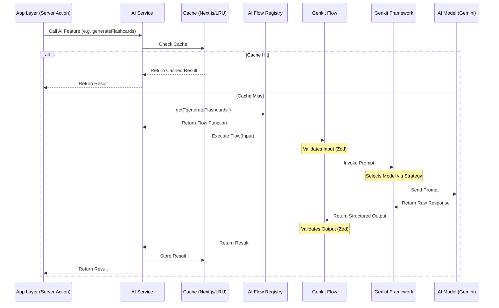

# AI Layer Documentation (Genkit)

This directory (`src/ai`) contains the application's AI logic, powered by [Genkit](https://firebase.google.com/docs/genkit) and Google Gemini models.

## 🧠 Overview

The AI layer is structured around **Flows**. A "Flow" is a strongly-typed, deployable unit of AI logic that:
1.  Accepts specific inputs (validated by Zod).
2.  Interacts with an AI model via a **Prompt**.
3.  Returns structured output (validated by Zod).

This architecture ensures that AI interactions are reliable, type-safe, and easy to test.

## 🏛️ Architecture

The AI layer follows a layered architecture to separate concerns, ensure testability, and provide robust observability.



### Key Components

1.  **AI Service (`src/services/ai.service.ts`)**: The entry point for the application. It handles caching, observability (logging/metrics), and error handling before calling the specific flow.
2.  **AI Flow Registry (`src/ai/flow-registry.ts`)**: A singleton registry that manages available flows. This decouples the service from specific flow implementations, allowing for easier testing and dynamic overrides.
3.  **Flows (`src/ai/flows/`)**: Self-contained units of logic that define the Input/Output schemas and the Prompt template.
4.  **Model Registry (`src/ai/model-registry.ts`)**: Manages the mapping between "Intents" (e.g., Fast, Reasoning) and specific Model IDs.

## 📂 Directory Structure

```
src/ai/
├── flows/             # Individual AI Flows (The core logic)
│   ├── find-similar-questions-flow.ts
│   ├── generate-company-strategy-flow.ts
│   └── ...
├── cache.ts           # In-memory caching for specific flows
├── dev.ts             # Entry point for the local Genkit Developer UI
├── flow-registry.ts   # Registry for managing AI flows
├── genkit.ts          # Genkit instance configuration
├── model-registry.ts  # Model strategy definitions
├── utils.ts           # Shared utilities (Retry, Truncate, etc.)
└── README.md          # You are here
```

## 🌊 The "Flow" Pattern

All AI features follow a consistent pattern. To add a new AI feature, you typically create a single file in `flows/` that contains:

1.  **Input Schema**: A Zod schema defining what data the AI needs.
2.  **Output Schema**: A Zod schema defining exactly what the AI must return (JSON).
3.  **Prompt Definition**: A template string (using Handlebars syntax) that instructs the AI.
4.  **Flow Definition**: The executable function that ties it all together.

### Example Template

```typescript
import { ai } from "@/ai/genkit";
import { z } from "genkit";

// 1. Define Input
export const MyInputSchema = z.object({
  topic: z.string(),
});

// 2. Define Output
export const MyOutputSchema = z.object({
  summary: z.string(),
  tags: z.array(z.string()),
});

// 3. Define Prompt
const myPrompt = ai.definePrompt({
  name: "myFeaturePrompt",
  input: { schema: MyInputSchema },
  output: { schema: MyOutputSchema },
  prompt: `
    You are a helpful assistant.
    Analyze the topic: {{topic}}
    Return a summary and relevant tags.
  `,
});

// 4. Define Flow
export const myFeatureFlow = ai.defineFlow(
  {
    name: "myFeatureFlow",
    inputSchema: MyInputSchema,
    outputSchema: MyOutputSchema,
  },
  async (input) => {
    // Execute the prompt
    const { output } = await myPrompt(input);
    
    if (!output) {
      throw new Error("AI failed to generate response");
    }
    
    return output;
  }
);
```

## 🎯 Model Strategies

We use an intent-based strategy pattern to select the right model for the job. This is defined in `src/ai/model-registry.ts`.

Instead of hardcoding model names (like `gemini-1.5-flash`) in every file, we use semantic intents:

*   **FAST** (`AI_MODELS.FAST`): For real-time, low-latency tasks (e.g., autocomplete, simple classification).
*   **STANDARD** (`AI_MODELS.STANDARD`): For most tasks requiring a balance of speed and capability (e.g., generating flashcards).
*   **REASONING** (`AI_MODELS.REASONING`): For complex tasks requiring deep analysis (e.g., generating code solutions or detailed strategies).

**Usage:**

The default model is configured in `src/ai/genkit.ts`. To use a specific strategy in a flow, you can specify it in the prompt configuration (if supported) or by configuring the Genkit instance to use a specific model for that prompt.

## 🛠️ Development

We use the Genkit Developer UI to test and debug prompts without running the full Next.js app.

### 1. Start the Genkit UI
```bash
pnpm genkit:dev
```
This runs `src/ai/dev.ts` and opens the developer tool at `http://localhost:4000`.

### 2. Registering New Flows
If you add a new flow file, **you must import it in `src/ai/dev.ts`** for it to appear in the Genkit UI.

```typescript
// src/ai/dev.ts
import "@/ai/flows/my-new-flow.ts"; // Add this line
```

## 📦 Integration

To use a flow in the application (e.g., in a Server Action), simply import the flow function and call it like a normal async function.

```typescript
// src/app/actions/some-action.ts
import { myFeatureFlow } from "@/ai/flows/my-new-flow";

export async function generateSummary(topic: string) {
  const result = await myFeatureFlow({ topic });
  return result;
}
```

## 🔍 Key Configuration

- **Model**: Configured in `src/ai/genkit.ts`. Currently defaults to `googleai/gemini-flash-lite-latest`.
- **Plugins**: Uses `@genkit-ai/googleai`.
